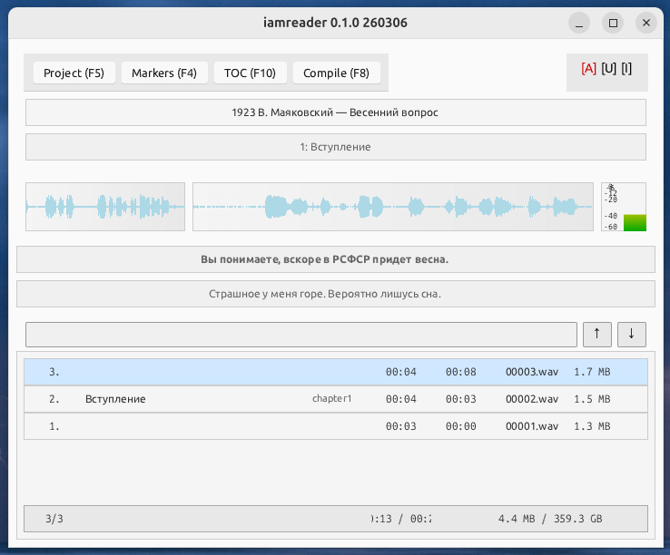

# iamreader

https://github.com/idlesign/iamreader-rs

Приложение для самостоятельного изготовления аудиокниг дикторами



## Особенности

* Гибкая система маркеров для отрывков (главы, сноски и пр.)
* Режимы вставки и замены отрывков
* Волновые графики текущего и предыдущего отрывка, индикатор уровня записи
* Сборка в wav и mp3 с поддержкой тегов и обложки
* Составление оглавления
* Опциональная нормализация звука при сборке
* Доступны при распознавании речи (см. AI ниже):
 * Отображение текста для текущего и предыдущего отрывка
 * Поиск по тексту


### AI

* Опциональное распознавание речи: Whisper
  Позволяет проще ориентироваться
* Опциональная очистка от шумов: Resemble Enhance denoiser
  При сборке запись будет очищена от фоновых шумов.


### Подход

Запись производится «отрывками». Отрывок может содержать столько зачитанного, сколько удобно чтецу.
Удобно принимать отрывок равным одному предложению. Каждый отрывок (фрагмент) в итоге оказывается на диске 
в виде отдельного файла. Отрывки можно помечать маркерами, например, разметить так начала глав или сноски.
В конечном итоге отрывки можно собрать в единый аудио-файл, либо в несколько файлов (по количеству секций). 

#### Типовой сценарий

* Краткую подсказку по клавишам можно получить, нажав F1.
* Чтец заполняет основные данные проекта в диалоге по клавише F5 
  (проект хранится в создаваемом в текущей директории файле `iamreader.json`).
* Чтец начинает запись (клавиша r).
* После очередной удачной фразы чтец утверждает отрывок (клавиша e) и автоматически начинается запись нового фрагмента.
* В случае неудачной фразы её можно перезаписать (клавиша r).
* Можно остановить запись без утверждения (клавиша d).
* Можно перемещаться к более старым записям (клавиша a) и к более новым (клавиша f).
* Если включено распознавание речи, доступен поиск по тексту. 
  Используйте поле ввода над списком фрагментов и кнопки вверх и вниз правее него для перемещения к найденному. 
* Можно запустить проигрывание запечатлённого ранее фрагмента (клавиша s).
* Чтец может заменить не только последний отрывок. 
  Для этого потребуется переместиться к нужному фрагменту, перейти в режим замены (клавиша U) и начать запись (r).
  После утверждения (e) фрагмент будет заменён новым.
* Чтец может вставить фрагмент между предыдущими. 
  Для этого потребуется переместиться к нужному фрагменту, после которого требуется вставка,
  перейти в режим вставки (клавиша I) и начать запись (r).
  После утверждения (e) будет вставлен новый фрагмент.
* Можно удалить отрывки.
  Для этого потребуется переместиться к нужному фрагменту и нажать клавишу Delete.
* По ходу записи чтец размечает фрагменты при помощи маркеров (цифровые клавиши), а также может ввести 
  для любого из фрагментов дополнительную информацию (двойной клик по строке отрывка).
* После завершения записи фрагментов чтец собирает (клавиша F8) финальный аудио-файл.

#### Маркеры

Маркерами можно помечать фрагменты. Добавить и настроить маркеры можно в диалоге по F4.

По умолчанию автоматически доступны маркеры для: 
* глав (chapter)
* начала сноски (footnote)
* окончания сноски (footnote_end)

Маркерам можно присвоить быстрые цифровые клавиши. Это даёт возможность при записи быстро размечать нужными 
маркерами нужные фрагменты — выделил фрагмент, нажал цифровую клавишу.

Маркерам, помимо псевдонима, можно присвоить название и дать описание.

Маркеры позволяют:

* При сборке финального файла автоматически модифицировать фрагменты, помеченные ими.
  Можно указать аудио-файл (ищется в директории `assets/`), который требуется проиграть до или после фрагмента, 
  в его начале или в конце (микс, подложка). Задать степень приглушения, а также количество повторов.
* Составлять Оглавление (TOC — F10), в котором видно время начала фрагментов, отмеченных маркерами. 
  Кнопка «Update meta» в диалоге маркеров позволяет после записи всех фрагментов пересчитать время начала
  каждого из них с учётом длительности дополнительных звуковых файлов (см. выше).
* При сборке делать не один файл, а разбивать запись на несколько по секциям 
  (при включении «Section split» в настройках проекта, а также «Section» для желаемого маркера). 


## Гарантии и ответственность

Автор не даёт никаких гарантий и не несёт никакой ответственности.

Используя приложение вы автоматически соглашаетесь с этими условиями.


## Системные требования

Процессор пошустрее, оперативки побольше, диск побольше и побыстрее (желательно ssd).

Приложение тестировалось на Ubuntu 24.10.

## Где взять

* Исходный код здесь: https://github.com/idlesign/iamreader-rs
* Готовые собранные версии доступны тут: https://github.com/idlesign/iamreader-rs/releases/


## Получение моделей AI

Из корня репозитория (нужен `wget`):

```bash
./get_models.sh
```

Приложение будет искать модели в каталоге `models/` рядом с исполняемым файлом.


## Разработка

### Подготовка окружения

Запускайте из корня репозитория. Установка системных зависимостей и загрузка моделей:

```bash
./dev_bootstrap.sh
```

### Сборка отладочная и запуск


```bash
./dev_debug.sh
```


### Сборка финальная

```bash
cargo build --release
```

Результат: исполняемый файл `target/release/iamreader`.
